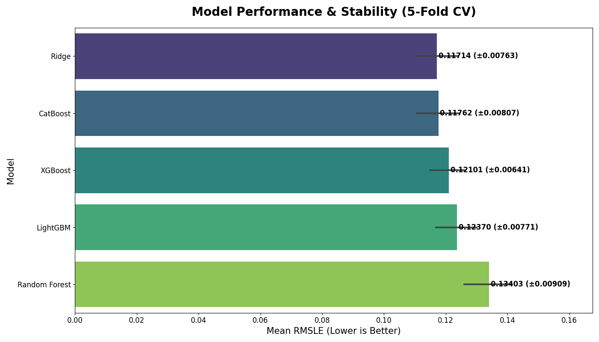

# House Prices - Advanced Regression Techniques (Kaggle Top 13%)

[](https://www.kaggle.com/competitions/house-prices-advanced-regression-techniques)
[](https://www.python.org/)
[](https://scikit-learn.org/)
[](https://pandas.pydata.org/)
[](https://catboost.ai/)


This repository contains a comprehensive solution for the Kaggle competition "House Prices: Advanced Regression Techniques". The goal of this project is to predict the final sale price of homes in Ames, Iowa, based on 79 explanatory variables.

This project goes beyond a simple baseline, employing a robust pipeline of advanced feature engineering, systematic model evaluation with cross-validation, and hyperparameter tuning to achieve a competitive score.

### Final Result
* **Kaggle Public LB Score:** **0.12450**
* **Ranking:** **Top 13%** (~650th out of 5,000+ teams)

### Model Performance Comparison

A rigorous 5-fold cross-validation was performed on five different models to identify the most performant and stable candidate. The results below show the mean Root Mean Squared Logarithmic Error (RMSLE) and the standard deviation across the folds.



The tuned **Ridge** and **CatBoost** models emerged as the top performers, demonstrating both high accuracy and strong stability.

### Methodology / Workflow

The solution was developed through a structured, iterative process:

1.  **Data Cleaning & Outlier Removal:** The process began with initial data cleaning, including the removal of two well-known outliers in the `GrLivArea` feature. The target variable, `SalePrice`, was also transformed using `log1p` to handle its right-skewed distribution.

2.  **Advanced Feature Engineering:** A comprehensive feature engineering function was created to enrich the dataset. Key techniques included:
    * **Smart Imputation:** Interpreting `NaN` values based on context (e.g., `NaN` in `PoolQC` means 'No Pool', not missing data).
    * **Ordinal Feature Mapping:** Converting categorical features with inherent order (e.g., `ExterQual`: 'Excellent', 'Good') into numerical rankings.
    * **Feature Creation:** Generating new, high-value features like `TotalSF` (total square footage), `HouseAge`, and interaction features (e.g., `OverallQual * TotalSF`).
    * **Skewness Transformation:** Applying a `log1p` transform to all numerical features with high skewness to normalize their distributions.

3.  **Modeling & Hyperparameter Tuning:** Five models, including three top-tier gradient boosting models (**LightGBM**, **XGBoost**, and **CatBoost**), were systematically evaluated. `GridSearchCV` was used to find the optimal set of hyperparameters for the boosting models.

4.  **Robust Validation Strategy:** Instead of relying on a single train-validation split, a **5-Fold Cross-Validation** framework was implemented. This provided a much more reliable estimate of each model's true performance on unseen data.

5.  **Final Prediction:** The champion model from the cross-validation analysis (tuned CatBoost) was retrained on the **entire** cleaned training dataset to maximize its learning before predicting on the final test set.

### How to Run
1.  Clone this repository: `git clone https://github.com/Luo0105/house_price.git`
2.  Ensure you have the required libraries installed.
3.  Place the competition data (`train.csv`, `test.csv`) in a designated folder.
4.  Run the Jupyter Notebook to see the full analysis and reproduce the results.

```mermaid
graph TD
    %% A. 数据准备阶段
    A[加载原始数据 train.csv and test.csv] --> B[数据清洗: 移除GrLivArea异常值];
    B --> C[准备完整训练集 X_full & y_full];

    %% B. 特征工程阶段 (使用子图)
    C --> FE;
    subgraph FE [高级特征工程]
        FE1[智能填充缺失值<br>(例如: NaN => 'None')];
        FE2[有序特征映射<br>(例如: 'Ex' => 5, 'Gd' => 4)];
        FE3[类型转换<br>(例如: MSSubClass => 类别)];
        FE4[创造新特征<br>(例如: TotalSF, HouseAge)];
        FE5[交互特征<br>(例如: Qual_x_TotalSF)];
        FE6[处理数值特征倾斜度<br>(Log1p变换)];
    end

    %% C. 建模与评估阶段 (使用子图)
    FE --> ME;
    subgraph ME [建模与评估]
        ME1(开始5折交叉验证);
        ME2{评估多个模型<br>RF, Ridge, LGBM, XGB, CatBoost};
        ME3[比较CV平均分与稳定性];
        ME4(选出最佳单模型: CatBoost<br>CV均分: ~0.117);
        ME1 --> ME2 --> ME3 --> ME4;
    end
    
    %% D. 最终预测阶段
    ME4 --> F[在100%完整训练数据上<br>重新训练最佳模型(CatBoost)];
    F --> G[对测试集应用<br>完全相同的特征工程];
    G --> H[使用最终模型进行预测];
    H --> I[生成提交文件 submission.csv];

    %% 设置样式 (可选, 美化)
    style FE fill:#f9f,stroke:#333,stroke-width:2px
    style ME fill:#ccf,stroke:#333,stroke-width:2px
