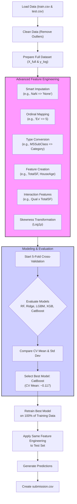

# House Prices - Advanced Regression Techniques (Kagle Top 13%)

This repository contains a comprehensive solution for the Kaggle competition "House Prices: Advanced Regression Techniques". The goal of this project is to predict the final sale price of homes in Ames, Iowa.

This project goes beyond a simple baseline, employing a robust pipeline of advanced feature engineering, systematic model evaluation with cross-validation, and hyperparameter tuning to achieve a competitive score.

### Final Result
* **Kaggle Public LB Score:** **0.12450**
* **Ranking:** **Top 13%** (~650th out of 5,000+ teams)

### Project Workflow

The entire project follows a structured, iterative process as illustrated below:

### Key Methodologies

1.  **Data Cleaning & Outlier Removal:** The process began with initial data cleaning, including the removal of two well-known outliers in the `GrLivArea` feature. The target variable, `SalePrice`, was also transformed using `log1p` to handle its right-skewed distribution.

2.  **Advanced Feature Engineering:** A comprehensive feature engineering function was created to enrich the dataset. Key techniques included:
    * **Smart Imputation:** Interpreting `NaN` values based on context (e.g., `NaN` in `PoolQC` means 'No Pool').
    * **Ordinal Feature Mapping:** Converting categorical features with inherent order (e.g., `ExterQual`: 'Excellent', 'Good') into numerical rankings.
    * **Feature Creation & Interaction:** Generating new, high-value features like `TotalSF`, `HouseAge`, and interaction features (e.g., `OverallQual * TotalSF`).
    * **Skewness Transformation:** Applying a `log1p` transform to all numerical features with high skewness.

3.  **Modeling & Hyperparameter Tuning:** Five models, including three top-tier gradient boosting models (**LightGBM**, **XGBoost**, and **CatBoost**), were systematically evaluated. `GridSearchCV` was used to find the optimal set of hyperparameters for the boosting models.

4.  **Robust Validation Strategy:** A **5-Fold Cross-Validation** framework was implemented to provide a reliable estimate of each model's true performance on unseen data.

### Model Performance Comparison

The following chart summarizes the performance and stability of all evaluated models based on the 5-fold cross-validation. The tuned **Ridge** and **CatBoost** models emerged as the top performers.

### Final Prediction Strategy

The champion model from the cross-validation analysis (tuned CatBoost) was retrained on the **entire** cleaned training dataset to maximize its learning before predicting on the final test set.

### How to Run
1.  Clone this repository: `git clone https://github.com/Luo0105/house_price.git`
2.  Ensure you have the required libraries installed.
3.  Place the competition data (`train.csv`, `test.csv`) in a designated folder.
4.  Run the Jupyter Notebook (`house-price-v2.ipynb`) to see the full analysis and reproduce the results.
